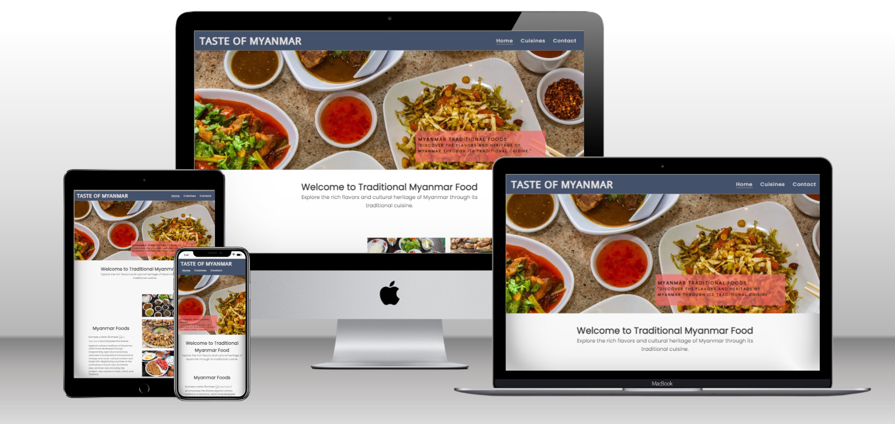
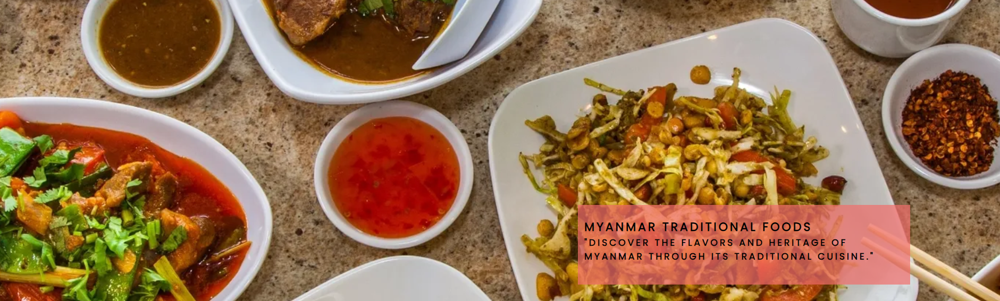
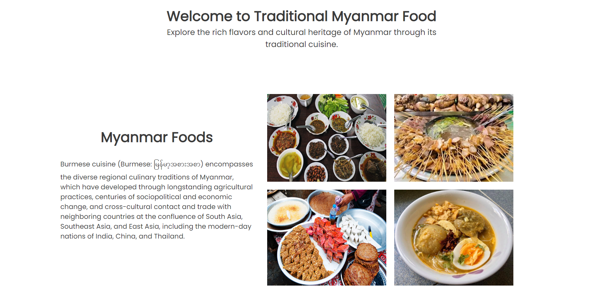
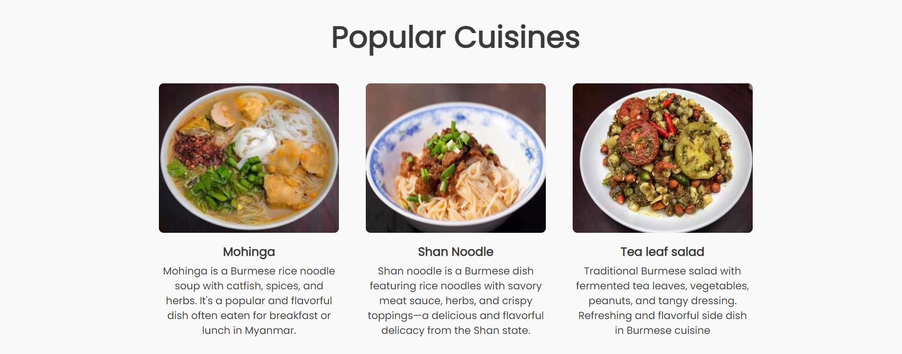
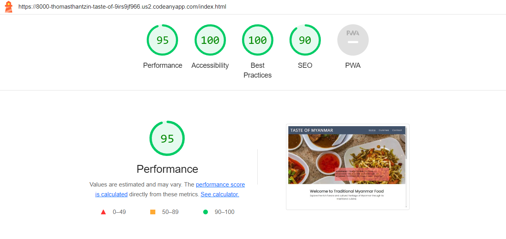
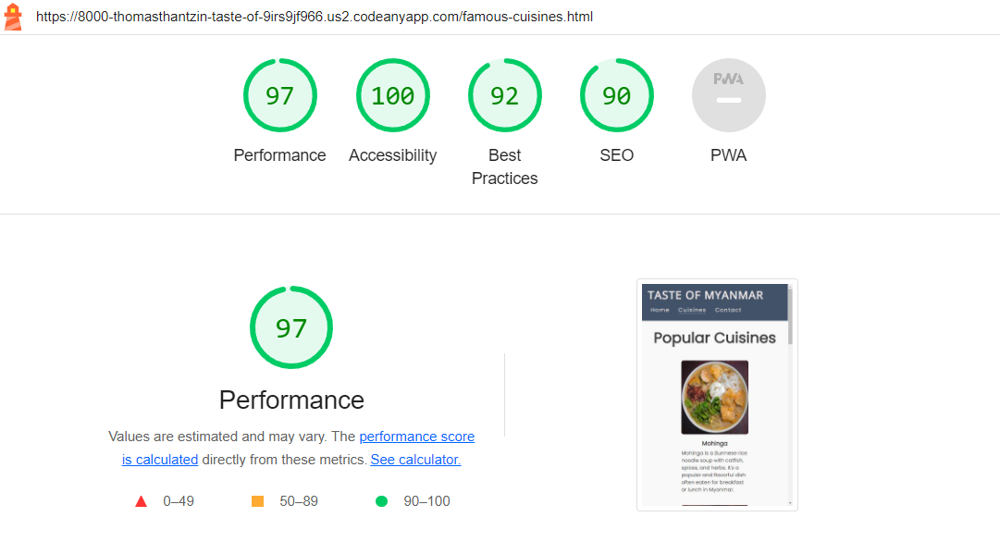
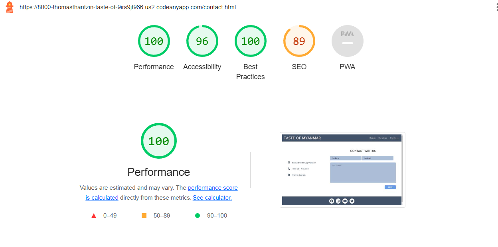

# Taste Of Myanmar

Taste of Myanmar is a site to share the delightful flavors, vibrant colors, and cultural significance of Burmese food.Make it easier to use and clear background.

At Myanmar Traditional Foods, I want to share the dishes that reflect Myanmar's rich culinary heritage. From mouthwatering curries to zesty salads that will transport you to the heart of Myanmar.

You can visit the website here: [Taste Of Myanmar](https://thomasthantzin.github.io/taste-of-myanmar/)

## Authors

- [Thant Zin Oo](https://github.com/ThomasThantZin)

## Feature

The website was designed in a way to mirror other websites users might be accustomed to, having a defining Logo at the top of each page and a Navbar with a familiar layout to may other sites will help users navigate the page from their first visit. This is consistent across all 3 pages to ensure ease of use and support the user exploring the site in full. The same design thought was used in creating the footer, ensure consistency and promote familiarity with the site.

### Fonts

Open Sans was used for H1 and Poppins is used for all other text.

### Existing Features

- **Navigation Bar**

  - Featured on all three pages, the full responsive navigation bar includes links to the Logo, Home page, Cusines and Contact page and is identical in each page to allow for easy navigation.
  - This section will allow the user to easily navigate from page to page across all devices without having to revert back to the previous page via the ‘back’ button.

- **The landing page image**

  - The landing includes a photograph with text overlay to allow the user to discover about Myanmar traditional food.
  - This section introduces the user to variety of Myanmar foods with an eye catching animation to grab their attention.

- **About food section**

  - This section will allow the user to know about Myanmar foods.
  - Showing the image of Myanmar food on right and explaining about Myanmar food on left.

- **Footer**

  - The footer section houses the social media links that are designed to open in a new browser. The goal of these is link the site with popular traffic drivers and connect rhough social medias.

- **Popular Cuisines**

      - In page is to share the users, what are the popular Myanmar foods and how it's made.
      - The design is simply made to be clear in user eyes.

  

- **Contact**

      - This page is to allow users to get in touch if they want to make queries or add more content to this web-site.
      - The user will be asked to submit their full name and email address and will be able to write what they want to talk to us.

  

### Feature to implement

- Links to Cooking site about how to make Myanmar foods and recipes for Myanmar foods .
- Hamburger menu to improve UX on mobile devices.

## Difficulties in making this website

- When writing for home page "about food" section, css styling made me abit confuse about margining and make flex display for text and 4 images.
- I've also faced the difficulties to make the web-site responsive for moblie size but I manage through it with the help of my friends.

## Testing

All pages were tested on Google Chrome, Safari and Firefox

### Validator Testing

- HTML

  - No errors were returned for home page when passing through the official [W3C validator](https://validator.w3.org/nu/?showsource=yes&doc=https%3A%2F%2Fthomasthantzin.github.io%2Ftaste-of-myanmar%2Findex.html)

  - No errors were returned for famous cuisines page when passing through the official [W3C validator](https://validator.w3.org/nu/?showsource=yes&doc=https%3A%2F%2Fthomasthantzin.github.io%2Ftaste-of-myanmar%2Ffamous-cuisines.html)

  - No errors were returned for Contact page when passing through the official [W3C validator](https://validator.w3.org/nu/?doc=https%3A%2F%2Fthomasthantzin.github.io%2Ftaste-of-myanmar%2Fcontact.html#textarea)

- CSS

  - No errors were found when passing through the official [(Jigsaw) validator](https://jigsaw.w3.org/css-validator/validator?uri=https%3A%2F%2Fthomasthantzin.github.io%2Ftaste-of-myanmar%2F&profile=css3svg&usermedium=all&warning=1&vextwarning=&lang=en)

  ### Performance

- **Performance checked from google light house.** - Hompage Performance
  

      - Cuisinespage Performance

  

      - Contactpage Performance

  

## Deployment

- The site was deployed to GitHub pages. The steps to deploy are as follows:
  - In the GitHub repository, navigate to the Settings tab
  - From the source section drop-down menu, select the Master Branch
  - Once the master branch has been selected, the page will be automatically refreshed with a detailed ribbon display to indicate the successful deployment.

The live link can be found here: [Taste Of Myanmar](https://thomasthantzin.github.io/taste-of-myanmar/)

## Credit

### Code
- Most of the codes are wrote by my own.
    - Took simple from Love Running project.
    - Took readme.md simple  from [Code Institute read me template](https://github.com/Code-Institute-Solutions/readme-template)
    

### Media

- Hero image on Home page - PO BURMESE KITCHEN
- In Homepage about food gallery "many food plates" image is from - indochinavoyage
- In Homepage about food gallery "pork skewers" image is from - [Myanmar Food and Order](https://www.facebook.com/people/Myanmar-Foods-Other/100069334454400/)
- In Homepage about food gallery "sweets desserts" image is from - austinbushphotography
- In Homepage about food gallery "fish noodle1" image is from - [Myanmar Food and Order](https://www.facebook.com/people/Myanmar-Foods-Other/100069334454400/)
- All photo from Cuisines page is from - [Myanmar Food and Order](https://www.facebook.com/people/Myanmar-Foods-Other/100069334454400/)

 #### This Website is only for Educational purpose.

 ## Acknowledgements 
 
I would like to take the opportunity to thank:

- To God, who is with me the whole time when i writing the code for this webpage.
- The lovely and helpful people on the Code Institute Slack page for support
- My lovely friends from Myanmar, who are helping me.
- To Code Institute Community for teaching me how to write these CODES.